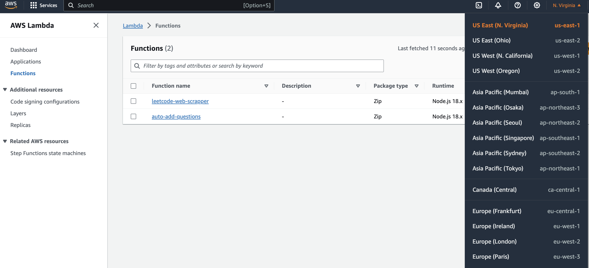
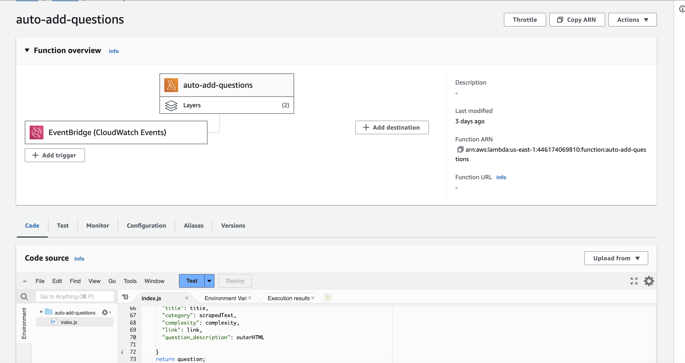
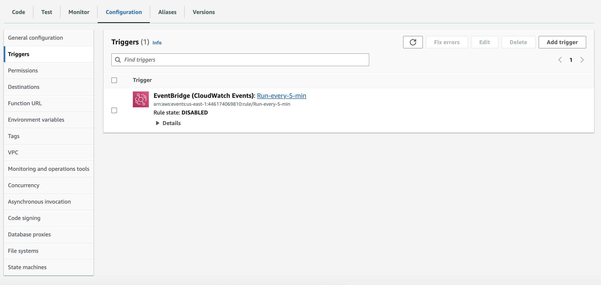
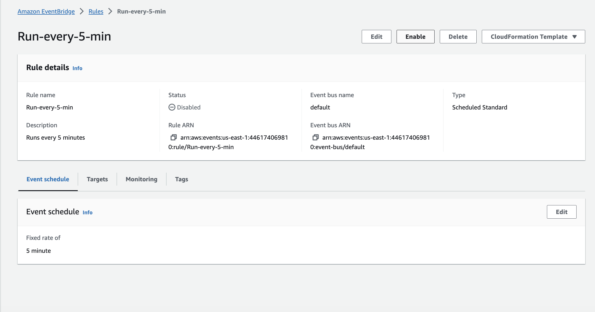

# Assignment 6 (Serverless Functions)

1. Login into the AWS management console as the IAM user ([https://aws.amazon.com/console/](https://aws.amazon.com/console/))
2. Login with the following credentials:
    - **Account ID (12 digits):** 446174069810
    - **AM user name:** 3219-marker
    - **Password:** ilove3219!!
3. Access Lambda via the console (and ensure that you are on the us-east-1 region)

    
    
4. Click on the lambda function titled “auto-add-questions” and navigate to the configuration tab
    
    
    
5. Find the trigger “EventBridge(CloudWatch Events)” and click on the URL link
    
    
    

1. Enable the rule and observe that a new question will be added every 5 minutes!
    
    
    
2. Please disable the rule once the selected batch of questions is added